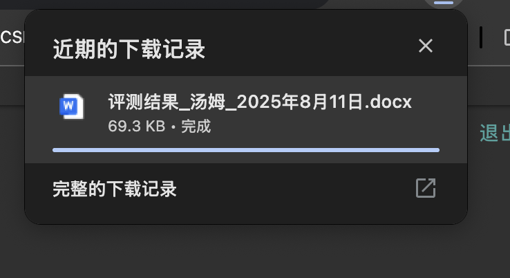
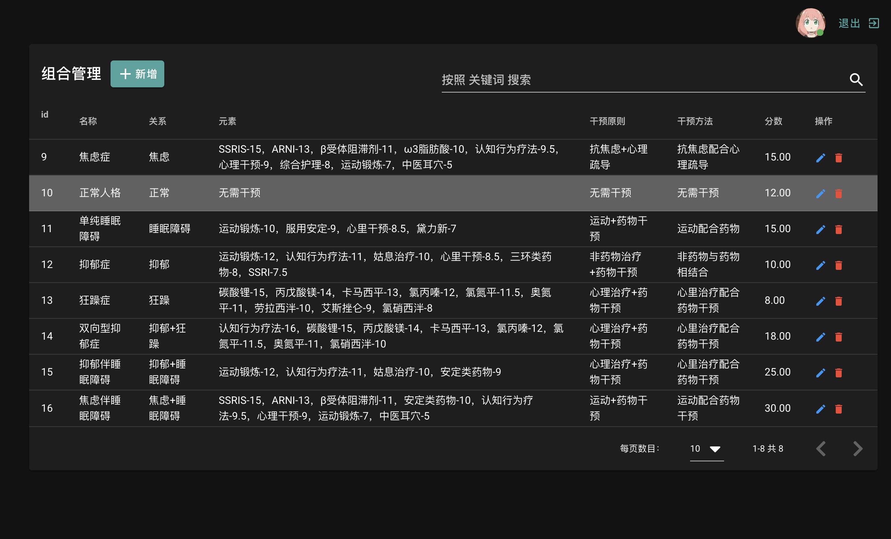

# vue+django 大模型心理学智能诊断评测系统干预治疗辅助系统、智慧心理医疗、带知识图谱
>  源码请添加微信:  maimaidashuju
或关注B站，有更多作品参考！

编号:D003 pro
> 基于大模型+心理学问卷、智能诊断：判断焦虑症、狂躁症、抑郁症、双向性抑郁症等，并且可以给出干预原则、干预方法进行心理治疗、药物治疗等建议。最后生成智能诊断报告+知识图谱。
## 功能模块简介
- 心理学问卷、智能诊断：判断焦虑症、狂躁症、抑郁症、双向性抑郁症等，并且可以给出干预原则、干预方法进行心理治疗、药物治疗等建议。
- 基于大模型的诊断结果的分析，在诊断过程中显示，并且在生成的报告中体现出来。
- 治疗方案：可以自由选择治疗手段，导出治疗报告word，同时保存在数据库中。
- 数据可视化：评测的结果进行可视化分析，可以评估系统稳定性。
- 知识图谱：诊断过程形成知识图谱并且可以保存下载为图片
- 心理学专业数据增删改查管理
- 用户管理、登录与注册
- 权限管理
- 日志管理


## 技术栈
- 后端框架：Django + Django REST Framework
- 前端框架：Vue.js + Vuetify UI组件库
- 数据库：MySQL
- 开发工具：PyCharm
## 功能介绍
系统是分评测者和管理员的
- 评测者使用的功能主要是心理评测和心理问答
- 管理员的功能有权限设置、用户管理、日志管理、心理系统管理（选项管理、组合管理、元素管理、特定选项管理）
### 登录注册模块
登录

注册


### 心理评测模块
心理评测分为五个步骤，系统使用一个步骤来完成
1. 填写个人信息：填写姓名、年龄、年级、学号等个人信息。
2. 填写问卷：填写问卷，基于心理规则和特定选项，每个选项都有一个权重，系统会根据用户的选择和权重，评估用户的心理状态。
3. 智能诊断：诊断基于系统的规则库，并且会通过大模型来辅助判断。
4. 评测报告：生成word版的评测报告，可以直接导出文件
5. 知识图谱：评测过程生成知识图谱。


下面给出每个步骤的截图：





部分代码：

```javascript
   computeSpecials(){
      if(this.selected.includes('有荨麻疹'))
        this.c_speicals = [...this.c_speicals, this.speicals.filter(s=>{
          return s.name == '长荨麻疹'
        })[0]]
      if(this.selected.includes('体重下降'))
        this.c_speicals = [...this.c_speicals, this.speicals.filter(s=>{
          return s.name == '体重下降'
        })[0]]
      if(this.selected.includes('容易感冒'))
        this.c_speicals = [...this.c_speicals, this.speicals.filter(s=>{
          return s.name == '容易感冒'
        })[0]]
      if(this.selected.includes('经常长口腔溃疡') && this.selected.includes('便秘'))
        this.c_speicals = [...this.c_speicals, this.speicals.filter(s=>{
          return s.name == '经常长口腔溃疡+便秘'
        })[0]]
      if(this.selected.includes('经常长口腔溃疡'))
        this.c_speicals = [...this.c_speicals, this.speicals.filter(s=>{
          return s.name == '经常长口腔溃疡'
        })[0]]
      if(this.selected.includes('便秘') && this.selected.includes('容易着急'))
        this.c_speicals = [...this.c_speicals, this.speicals.filter(s=>{
          return s.name == '便秘+容易着急'
        })[0]]
    },
    computeCombinations(){
      this.yy=0
      this.jl=0
      this.kz=0
      this.smza=0
      this.combis.forEach(c=>{
        // eslint-disable-next-line no-prototype-builtins
        if(this.type.hasOwnProperty(c.relation)){
          if(this.type[c.relation]>c.score){
            // console.log(c.relation)
            this.c_combis.push(c)
            if(c.relation == '抑郁')
              this.yy = 1
            if(c.relation == '焦虑')
              this.jl = 1
            if(c.relation == '狂躁')
              this.kz = 1
            if(c.relation == '睡眠障碍')
              this.smza = 1
          }
        }
      })

      if(this.yy && this.kz){
        this.c_combis = [...this.c_combis, ...this.combis.filter(c=>{
          return c.relation == '抑郁+狂躁'
        })]
      }
      if(this.yy && this.smza){
        this.c_combis = [...this.c_combis, ...this.combis.filter(c=>{
          return c.relation == '抑郁+睡眠障碍'
        })]
      }
      if(this.jl && this.smza){
        this.c_combis = [...this.c_combis, ...this.combis.filter(c=>{
          return c.relation == '焦虑+睡眠障碍'
        })]
      }
    },
```
### 心理助手
可以通过聊天方式和大模型进行交流，帮助用户获取心理服务


### 心理评测管理模块
测评选项管理

组合规则引擎

特殊选项管理


评测元素管理

###  用户与权限管理管理
细粒度角色权限控制

完整的用户生命周期管理：支持用户创建、查询、更新和逻辑删除（非物理删除）

日志管理

### 个人信息
修改个人信息、头像等

修改密码

